# AES-256-GCM Secure Video Pipeline

Pcam 영상이 DDR에 평문으로 기록되기 전에 Zybo TX의 PL에서 암호화되고, Jetson 중간 노드를 거쳐 Zybo RX에서 인증·복호화되는 종단간 영상 보안 데모입니다. Jetson은 정상 트래픽 관찰과 공격 시연을 담당하고, RX와 PC 콘솔은 공격 탐지 결과와 복호 영상을 보여줍니다.


## 데이터 흐름

```text
Pcam
  │ 1280×720 YUYV
  v
Zybo Z7-20 TX
  PL pack128 -> AES-256-GCM -> UDP video packet
  │
  │ AAD 16 B + Ciphertext 1440 B + TAG 16 B
  v
Jetson Orin Nano (2-NIC transparent bridge)
  ├─ packet metadata / entropy / throughput observation
  ├─ ciphertext tamper
  ├─ authenticated packet replay
  └─ weak-session key search + recovered frame VLM analysis
  │
  v
Zybo Z7-20 RX
  PL authentication -> replay/sequence/session/timeout checks -> decrypt
  ├─ HDMI 720p60 carrier, content 약 30 fps
  └─ UART security telemetry
  │
  v
PC Receiver Console
  live video + attack state + detector counters + event timeline
```

세션 키는 별도 Wi-Fi 제어 채널에서 X25519 static-static ECDH와 HKDF-SHA256으로 유도하고, 인증된 AES-GCM session capsule을 통해 TX/RX에 적용합니다. 영상 경로의 Jetson은 L2 bridge로 동작하므로 정상 모드에서는 암호화 패킷을 수정하지 않습니다.

## 보안·패킷 계약

| 항목 | 값 |
|---|---|
| 영상 | 1280×720 YUYV, 약 29~30 fps |
| 알고리즘 | AES-256-GCM |
| 패킷 | AAD 16 B + ciphertext 1440 B + authentication tag 16 B = 1472 B |
| GCM nonce | `session_id[31:0] || frame_id[31:0] || 16'h0000 || packet_id[15:0]` |
| 다중 바이트 필드 | Network / big-endian |
| 세션 설정 | X25519 ECDH + HKDF-SHA256 + AES-GCM capsule |
| RX 탐지 | TAG, REPLAY, SEQUENCE, SESSION, TIMEOUT |
| 영상 출력 | RX HDMI 1280×720p60 carrier |
| 상태 출력 | RX UART 115200 baud + Jetson HTTP API |

## 하드웨어 구성

| 영상 입력 | 암호화·복호화 FPGA | 중간 보안 노드 | 제어망 어댑터 |
|---|---|---|---|
| 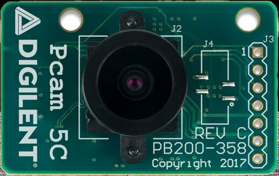<br>Pcam | 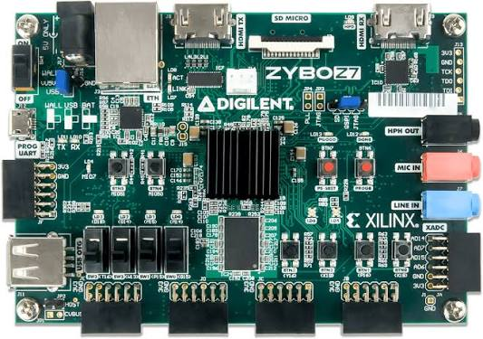<br>Zybo Z7-20 × 2 | 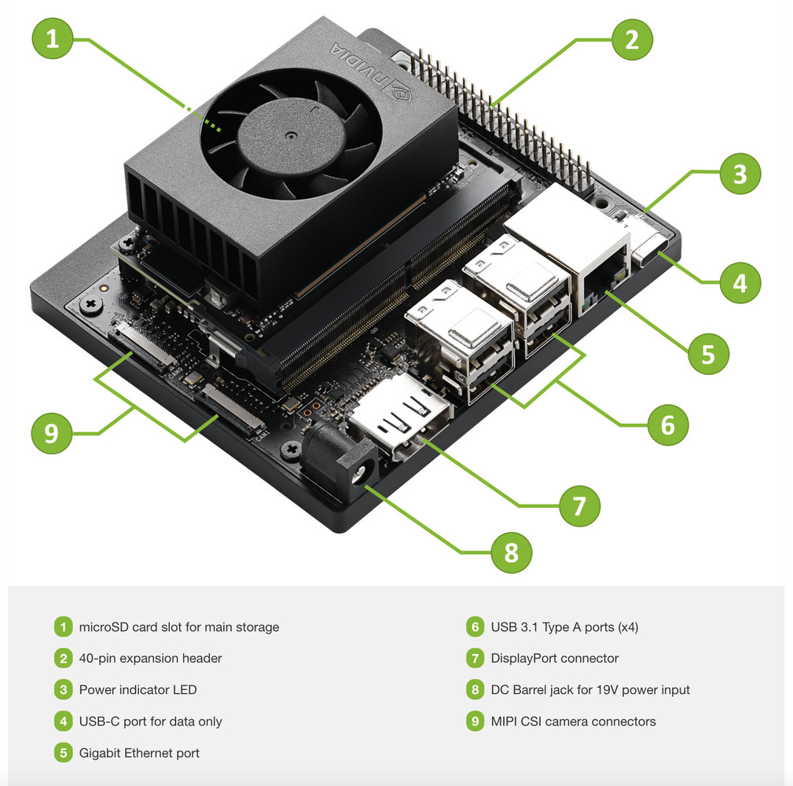<br>Jetson Orin Nano | 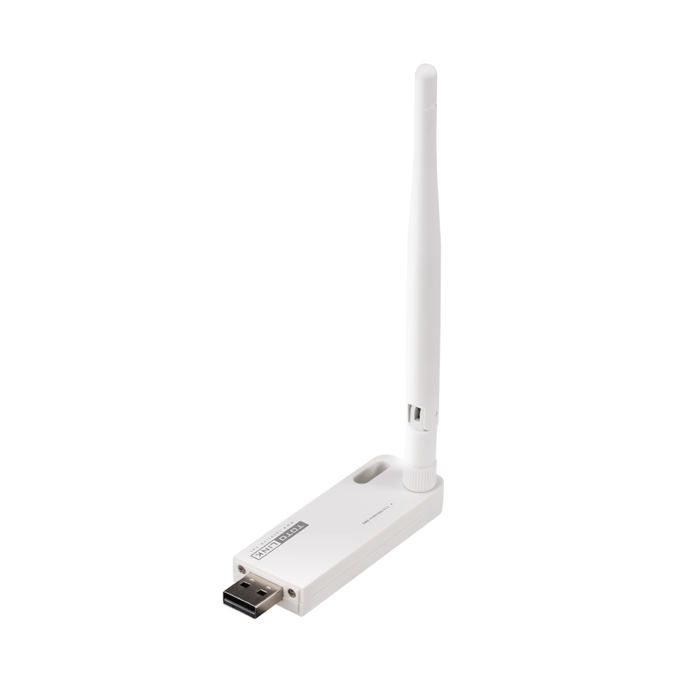<br>USB Wi-Fi |

TX는 Pcam과 연결되고 RX는 HDMI capture board 및 UART로 PC에 연결됩니다. Jetson의 두 유선 NIC는 TX와 RX 사이의 `br-video`에 들어가며, Wi-Fi는 대시보드 접속과 세션 제어에 사용합니다.

## 데모 화면

### 정상 수신과 이벤트 기록


정상 수신 화면은 복호 영상, Jetson 연결 상태, RX 보안 상태와 5종 탐지 누계를 함께 표시합니다. 보안 분석 페이지와 이벤트 로그는 공격의 시작·탐지·복구 흐름을 시간순으로 남깁니다.

| 보안 분석 페이지 | 이벤트 로그 |
|---|---|
| 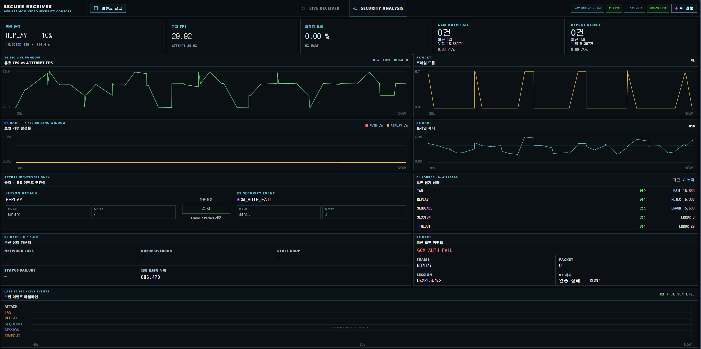 | 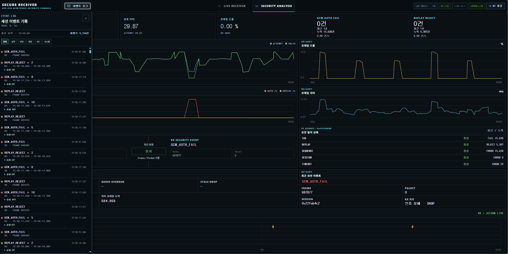 |

### 위·변조 및 재전송 공격

Jetson의 Tamper 엔진은 ciphertext 비트를 바꾸고 기존 TAG를 유지해 GCM 인증 실패를 유도합니다. Replay 엔진은 정상 인증 패킷을 저장한 뒤 다시 주입해 RX의 freshness 검사를 자극합니다.

| Ciphertext tamper | Authenticated packet replay |
|---|---|
| 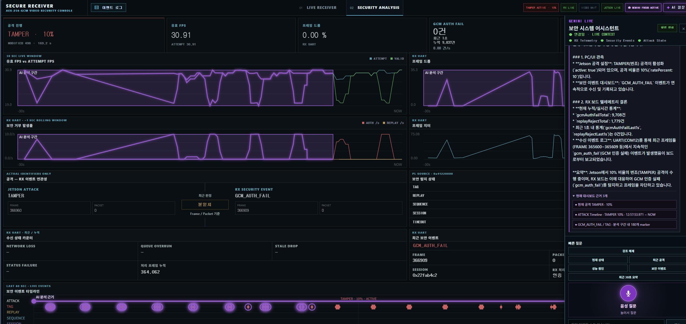 | 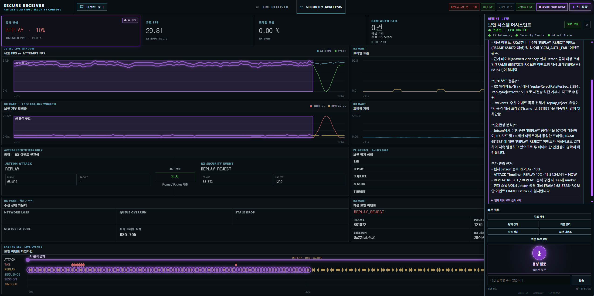 |

### 약한 키 탐색과 VLM 분석

Weak Session은 교육·데모를 위한 명시적 모드입니다. Jetson이 요청 ID, seed bit 수와 실제 session ID를 대조한 뒤 관찰 패킷의 TAG 검증에 성공하는 키를 찾고, 복원 프레임은 사용자가 요청할 때만 로컬 VLM으로 분석합니다.

| 키 탐색 결과 | 복원 프레임 VLM 분석 |
|---|---|
| 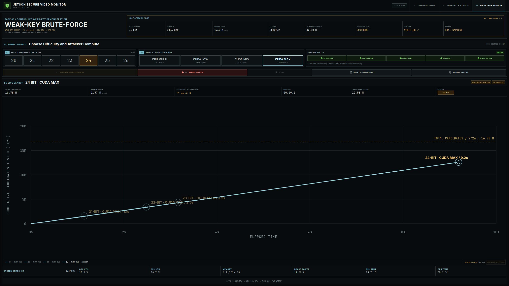 | 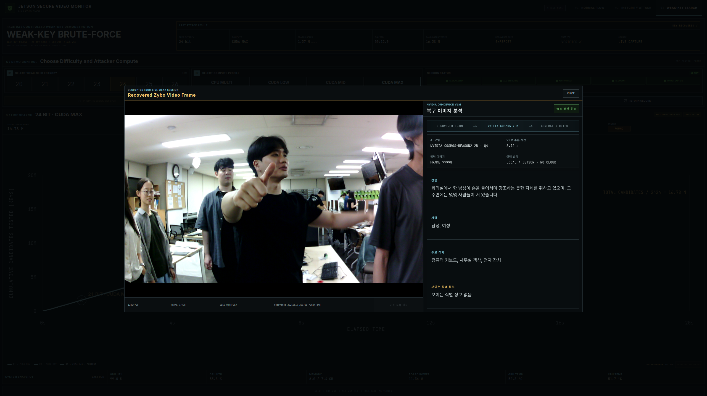 |

## 소스 구조

```text
AES/
├── fpga/
│   ├── tx/                    TX RTL, XDC, Tcl, TB, PetaLinux source
│   ├── rx/                    RX RTL, 5종 detector, HDMI, IP repo, PetaLinux
│   ├── session_control/       ECDH/HKDF/capsule agent와 복구 테스트
│   ├── stm32/                 NUCLEO-F411 UART echo source
│   └── scripts/               TX/RX 공통 빌드·JTAG·SD 보조 스크립트
├── jetson/
│   ├── bridge/                2-NIC L2 bridge 적용·복구 스크립트
│   └── dashboard/             backend, UI source, 공격·분석 엔진, 테스트
├── pc/
│   ├── dashboard/             HDMI/UART 수신 웹 콘솔과 설정 예시
│   └── preview/               경량 HDMI capture 미리보기
├── verification/
│   ├── nist_kat/              NIST AESAVS 405-vector KAT
│   ├── aes256_c_vs_fpga/      C/OpenSSL golden과 RTL 10,000건 비교
│   ├── tx_uvm/                TX UVM TB와 1280-packet golden handoff
│   ├── rx_uvm/                RX 인증·5종 오류 UVM regression
│   └── tx_rx_loopback/        TX 출력에서 RX 복호까지 loopback
└── assets/                    이 문서에 사용하는 구조·장비·데모 이미지
```

| 위치 | 역할 |
|---|---|
| [`fpga/tx`](fpga/tx/README.md) | 카메라 16-bit stream을 128-bit로 묶고 PL에서 AES-GCM 암호화 |
| [`fpga/rx`](fpga/rx/README.md) | 패킷 인증·복호화, 5종 오류 계수, HDMI와 UART 상태 출력 |
| [`fpga/session_control`](fpga/session_control/README.md) | 세션 생성·capsule 전달·재부팅 복구·Wi-Fi supervision |
| [`jetson/bridge`](jetson/bridge/README.md) | 두 유선 NIC의 투명 bridge 구성 |
| [`jetson/dashboard`](jetson/dashboard/README.md) | 관찰 UI, Tamper/Replay/Weak-Key/VLM backend |
| [`pc/dashboard`](pc/dashboard/README.md) | RX HDMI·UART와 Jetson 상태를 통합한 PC 콘솔 |
| [`pc/preview`](pc/preview/README.md) | USB HDMI capture 단독 점검 도구 |
| [`verification`](verification/README.md) | 암호 코어부터 TX/RX 종단까지의 검증 계층 |

## 실행 개요

### FPGA

Vivado 2025.2와 Zybo Z7-20 board files가 준비된 환경에서 저장소 루트를 기준으로 실행합니다. Tcl은 자신의 위치를 기준으로 RTL과 XDC를 찾고 `project/`를 새로 생성합니다.

```powershell
vivado -mode batch -source .\AES\fpga\tx\vivado\tcl\build_aes_gcm_tx.tcl
vivado -mode batch -source .\AES\fpga\rx\vivado\tcl\build_aes_gcm_rx.tcl
```

PetaLinux 사용자 소스와 빌드 진입점은 각 보드의 `petalinux/`에 있습니다.

```bash
cd AES/fpga/tx/petalinux
./build_petalinux.sh
```

RX도 같은 방식으로 `AES/fpga/rx/petalinux`에서 실행합니다. 생성되는 bitstream, XSA, boot image와 SD card 파일은 저장소에 포함하지 않습니다.

### Jetson

두 유선 NIC를 bridge로 묶은 뒤 대시보드를 시작합니다.

```bash
cd AES/jetson/bridge
sudo ./scripts/apply_br_video.sh
```

```bash
cd AES/jetson/dashboard
./operator/start-dashboard.sh
```

대시보드는 기본적으로 `0.0.0.0:4173`에서 서비스됩니다. CUDA 검색기는 `bruteforce/weakkey_search.cu`, 로컬 VLM 앱은 `local-vlm-test/`에 소스만 포함돼 있습니다. 모델과 CUDA runtime은 장비에 별도로 배치해야 합니다.

### PC

```bat
cd AES\pc\dashboard
copy pc_rx_ui.env.example.cmd pc_rx_ui.env.cmd
run_pc_ui.bat
```

기본 주소는 `http://127.0.0.1:8765/`이며, HDMI capture device는 브라우저에서 선택합니다. 실제 API 키나 장비별 주소가 든 `pc_rx_ui.env.cmd`는 Git 대상에서 제외됩니다.

## 검증 결과

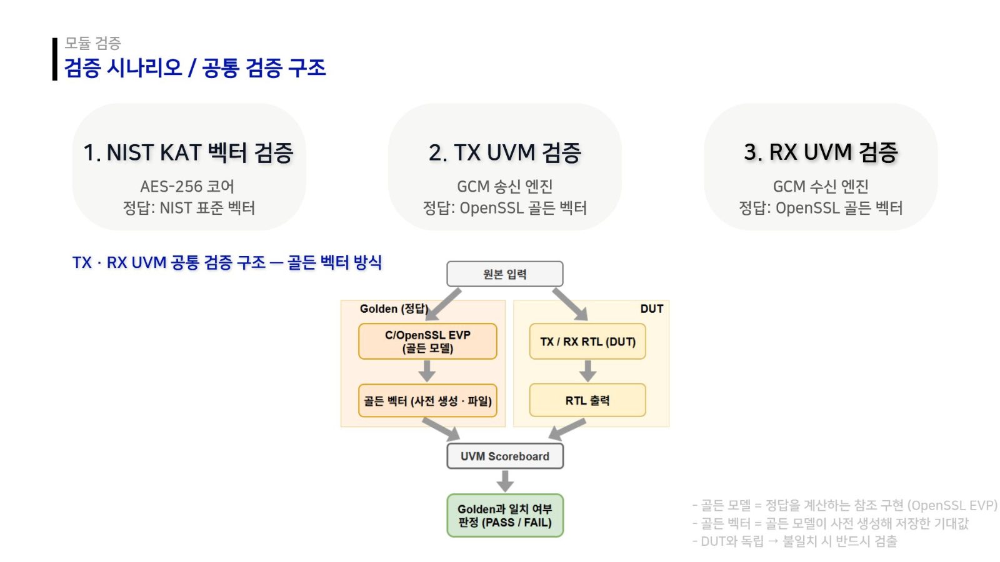

| 계층 | 검증 내용 | 정리 시 확인 결과 |
|---|---|---|
| AES-256 core | NIST AESAVS ECB-256 KAT, xsim/VCS | 405/405, 0 fail |
| C ↔ RTL | OpenSSL golden 기반 10,000개 AES-256 block | C 10,000/10,000, RTL 10,000/10,000 일치 |
| TX UVM | ciphertext/AAD/TAG, AXI backpressure, 1280 packets | mismatch 0, protocol error 0 |
| RX UVM | 정상·TAG/Cipher tamper·replay·sequence·session·timeout·backpressure | regression PASS |
| TX → RX | 실제 TX handoff record를 RX에 입력해 plaintext와 비교 | loopback PASS |
| Jetson backend | packet metadata, attack status, weak-key/VLM lifecycle | Python 19 tests PASS |
| Jetson UI | replay/tamper/weak-key 표시 계약 | JavaScript 8 tests PASS |
| PC UI | event timeline, OCC gate, AI evidence, video frame 상태 | JavaScript 7 tests PASS |
| PC backend | UART/API/state 자체 검사 | self-test PASS |

재현 명령과 각 검증의 범위는 [verification/README.md](verification/README.md)에 모았습니다.

## 저장소에 포함하지 않은 항목

- PDF/DOC/DOCX/PPT/PPTX 원본: 구조도와 결과 화면은 필요한 부분만 PNG와 이 문서의 설명으로 옮겼습니다.
- Vivado/PetaLinux/VCS 생성물: project, bitstream, XSA, boot image, simulator binary, coverage DB, 로그.
- 로컬 VLM 모델·CUDA runtime·Node/Python dependency cache.
- 컴파일된 Tamper/Replay/Weak-Key/session agent 실행 파일.
- PC 로컬 환경 파일과 실행 중 생성되는 상태 파일.

골든 입력 벡터와 TX/RX handoff `.bin`은 테스트 재현에 필요한 데이터이므로 예외적으로 `verification/`에 보존했습니다.
