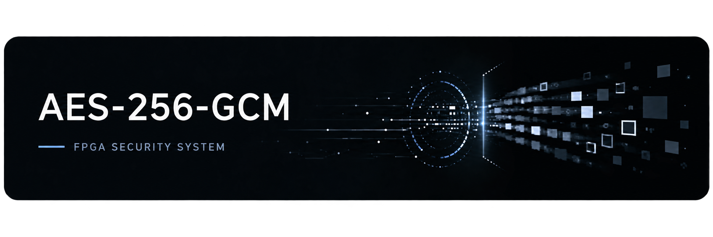
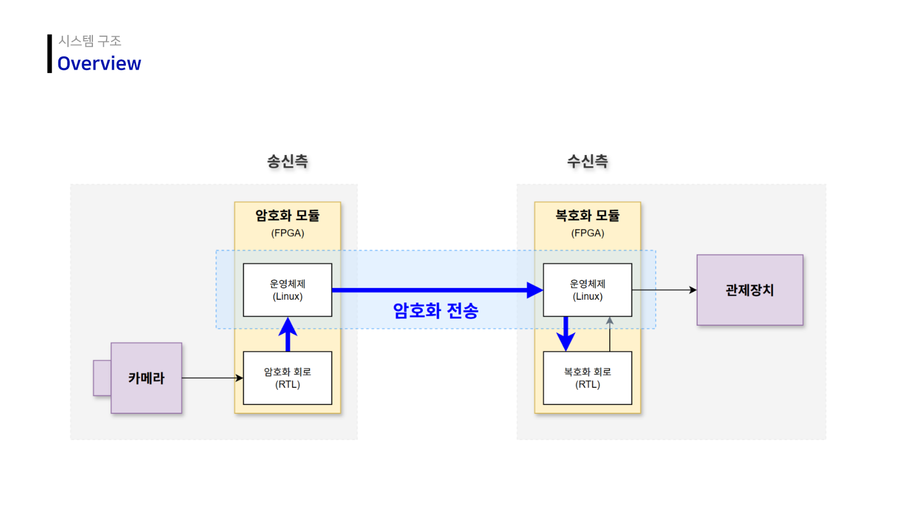
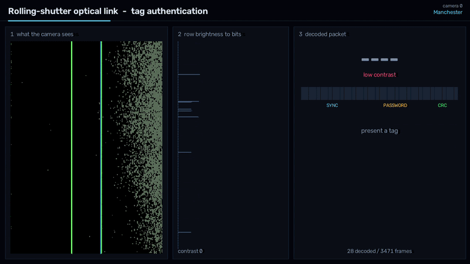
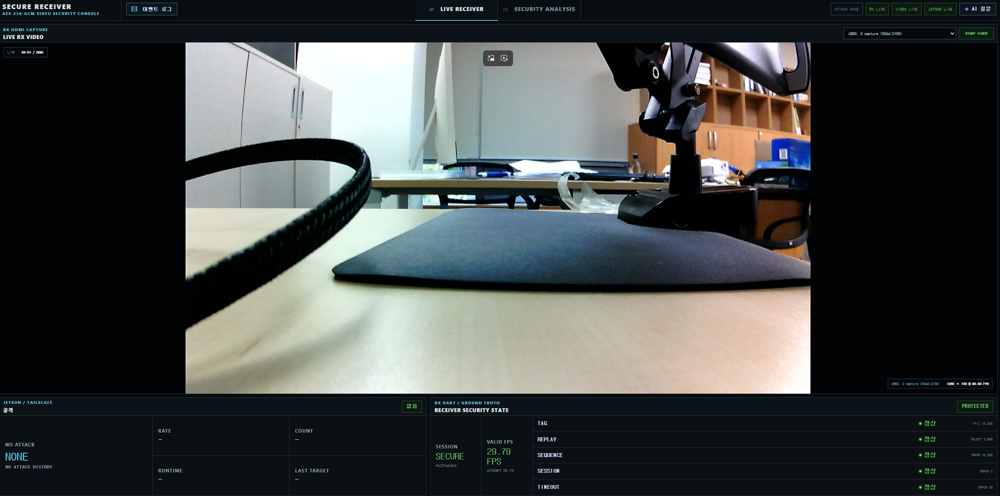
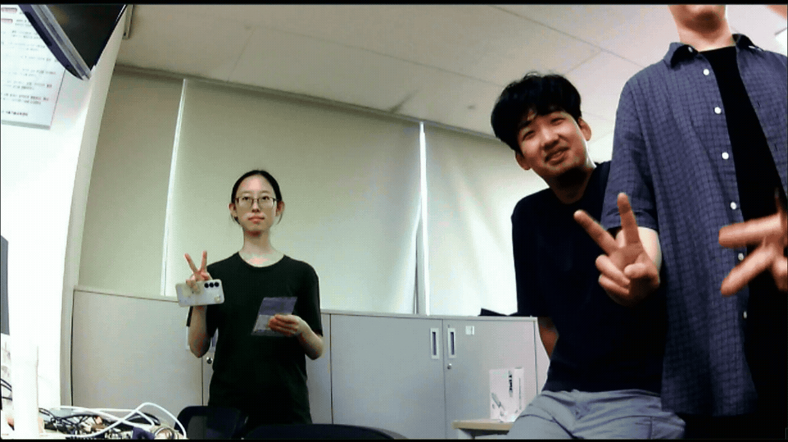
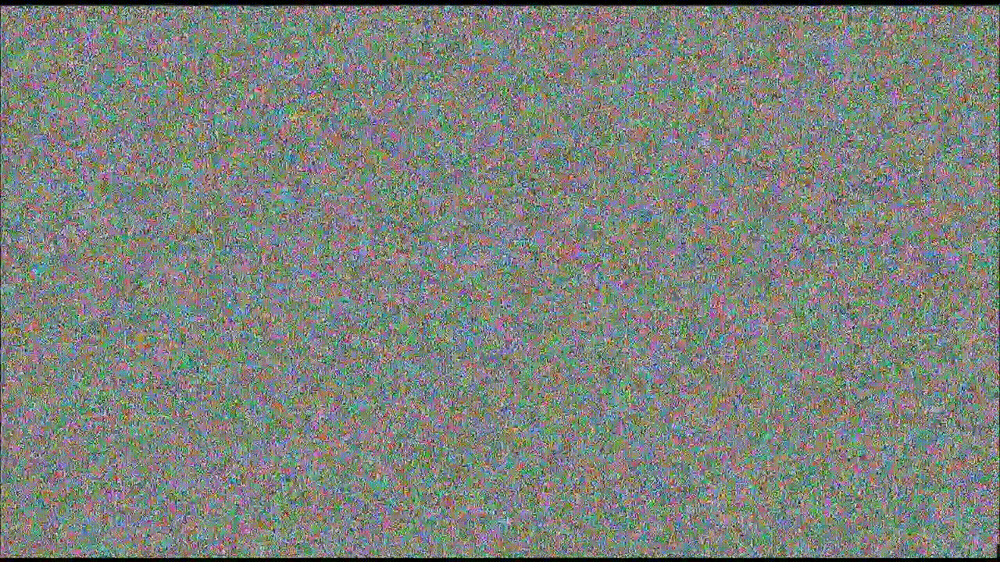

<p align="center">
  
</p>

FPGA 기반 광통신과 암호화 영상 전송을 함께 다루는 팀 통합 저장소입니다. 단순히 암호 알고리즘을 실행하는 데서 끝나지 않고, **물리 채널의 자격증명 전달 → FPGA 실시간 암호화 → 네트워크 중간 공격 → 수신단 차단과 가시화**까지 하나의 데모 흐름으로 구성했습니다.

이 저장소는 하드웨어에 합성되는 RTL, 임베디드 제어 소스, Jetson 공격·관찰 도구, PC 모니터링 화면과 재현 가능한 검증 코드를 소스 중심으로 보존합니다.

## 기술 스택

| 구분 | 기술 |
| --- | --- |
| RTL / FPGA | SystemVerilog, Vivado |
| Embedded / Software | C, Python, JavaScript, PetaLinux |
| Verification | UVM, Synopsys VCS/Verdi, Vivado xsim, OpenSSL, NIST KAT |
| Security / Network | AES-256-GCM, X25519, HKDF-SHA256, UDP/Ethernet |
| Hardware | Zybo Z7-20, Pcam 5C, Jetson Orin Nano, Basys 3, OV7670, STM32 NUCLEO-F411 |

## 프로젝트가 다루는 문제

| 관점 | 질문 | 프로젝트의 접근 |
|---|---|---|
| 물리 접근 | 카메라가 LED 신호에서 자격증명을 안정적으로 읽을 수 있는가? | Rolling-shutter 행 밝기와 OOK/Manchester 변조를 이용해 credential·CRC를 복원 |
| 기밀성 | 카메라 평문이 메모리나 전송망에 노출되지 않는가? | Zybo TX의 PL에서 DDR 기록 전에 AES-256-GCM 암호화 |
| 무결성 | 전송 중 ciphertext나 TAG가 바뀌면 영상이 출력되지 않는가? | Zybo RX가 인증에 실패한 packet을 폐기하고 출력 payload를 0으로 치환 |
| 신선성 | 정상 패킷을 다시 보내거나 순서를 건너뛰면 잡을 수 있는가? | REPLAY bitmap, packet sequence, session ID와 timeout 검출 |
| 관찰 가능성 | 공격이 실제로 어디에서 발생하고 어떻게 차단됐는지 설명할 수 있는가? | Jetson 공격 상태, RX detector, PC 이벤트 타임라인을 함께 표시 |
| 검증 가능성 | 화면이 정상처럼 보이는 것 외에 RTL의 정확성을 증명할 수 있는가? | NIST KAT, OpenSSL/C 비교, TX/RX UVM과 TX→RX handoff 검증 |

## 프로젝트 구성

| 프로젝트 | 핵심 내용 | 주요 장비 | 상세 문서 |
|---|---|---|---|
| Rolling-Shutter OCC | LED의 시간축 변조를 카메라 행 밝기로 복조하고 자격증명·CRC를 판정 | Basys3, OV7670, LED 송신부 | [Rolling_Shutter_OCC](Rolling_Shutter_OCC/README.md) |
| AES-256-GCM Secure Video | 카메라 영상을 FPGA에서 암호화하고 중간 공격·수신 인증·오류 탐지를 시연 | Pcam, Zybo Z7-20 TX/RX, Jetson Orin Nano, PC | [AES](AES/README.md) |

두 프로젝트는 각각 독립적으로 합성·실행할 수 있습니다. 통합 데모에서는 OCC Reader의 최신 `PASS` 판정을 PC 수신 콘솔의 접근 게이트로 사용할 수 있고, 그 뒤 AES 영상 보안 데모의 정상·공격 화면을 확인합니다. 즉 OCC는 **접근 자격증명 채널**, AES 파이프라인은 **영상 데이터 보호 채널** 역할을 합니다.

## 전체 설계

```text
Physical credential plane
  Basys3 Tag + LED
       │  OOK / Manchester optical signal
       v
  OV7670 + Basys3 Reader
       └─ sync + credential + CRC ──UART PASS/FAIL──┐
                                                    │
Secure video data plane                            v
  Pcam ─> Zybo TX ──encrypted UDP──> Jetson ──> Zybo RX ──HDMI/UART──> PC
           │                          │               │                  │
           ├─ pre-DDR AES-256-GCM     ├─ observe      ├─ authenticate    ├─ access gate
           ├─ packet AAD/nonce        ├─ tamper       ├─ decrypt         ├─ live video
           └─ session key registers   ├─ replay       ├─ 5 detectors     └─ event timeline
                                      └─ weak-key/VLM

Session control plane
  TX/RX USB Wi-Fi ── X25519 ECDH + HKDF-SHA256 + authenticated capsule
```



### OCC 설계 핵심

- Tag는 `SYNC(16) + credential(16) + CRC8` 패킷을 LED OOK 또는 Manchester로 반복 송신합니다.
- Reader는 OV7670 프레임에서 LED가 차지하는 행의 밝기 변화를 시간축 신호로 사용합니다.
- rolling shutter의 행별 노출 시점 차이가 수평 band를 만들며, Reader RTL이 sync 탐색·비트 복조·CRC·credential 비교를 수행합니다.
- 카메라의 실제 행 주기를 측정해 TX 반비트 clock을 맞추므로 계산값과 실측 frame timing의 차이를 보정할 수 있습니다.
- 판정은 FND·LED·VGA·UART로 동시에 노출해 물리 신호부터 최종 credential 결과까지 단계별로 확인할 수 있습니다.

### AES 설계 핵심

- TX는 Pcam YUYV stream을 128-bit block으로 묶어 PL에서 암호화합니다. 정상 secure mode에서는 카메라 평문이 DDR 경로를 거치지 않습니다.
- 영상 packet은 `AAD 16 B + ciphertext 1440 B + TAG 16 B`로 고정하며 session/frame/packet ID로 nonce와 freshness 문맥을 구성합니다.
- Jetson은 두 유선 NIC 사이의 투명 L2 bridge입니다. 정상 상태에서는 패킷을 통과시키고 데모 시에만 ciphertext bit 변조나 정상 packet 재주입을 수행합니다.
- RX는 authentication 성공 전에는 plaintext를 외부로 내보내지 않습니다. 거부 packet은 zero payload로 대체하고 TAG·REPLAY·SEQUENCE·SESSION·TIMEOUT을 각각 계수합니다.
- AES-256 코어는 OpenSSL golden 기준 C/RTL 각각 10,000/10,000개 벡터가 일치했으며, 150 MHz에서 AES 전용 명령을 배제한 scalar C 대비 최대 2.344배의 처리 성능을 확인했습니다. [검증 상세](AES/verification/README.md#2-scalar-c--openssl--rtl-비교)
- PC 콘솔은 RX HDMI 영상, UART detector, Jetson 공격 상태를 합쳐 “공격 실행”과 “수신 차단”을 같은 타임라인에서 보여줍니다.

## 통합 데모 시나리오

| 순서 | 조작 | 기대 화면·신호 | 확인하려는 설계 |
|---:|---|---|---|
| 1 | TX/RX와 Jetson bridge를 기동 | PC에 정상 복호 영상, detector 증가 없음 | 기본 암호화·복호화 경로와 약 30 fps content flow |
| 2 | OCC Tag에서 허용 credential 송신 | Reader CRC/credential 통과, PC 접근 게이트 해제 | 물리 자격증명 판정이 UI 접근 제어로 연결되는지 |
| 3 | Jetson에서 Tamper 시작 | Jetson은 bit 변경을 보고하고 RX는 TAG 오류를 증가 | GCM 무결성 검사가 변조 payload 노출을 막는지 |
| 4 | 정상 packet을 capture 후 Replay | RX에서 REPLAY와 SEQUENCE 문맥 발생 | 인증된 과거 packet도 freshness 검사로 차단되는지 |
| 5 | Weak Session 생성 후 key search | 관찰 packet의 TAG로 key 후보 검증, frame recovery | 의도적으로 축소한 key space가 왜 위험한지 |
| 6 | 복원 frame에 VLM 분석 요청 | 검증된 현재 run의 frame만 분석 | 공격 결과와 AI 분석 사이의 run/image identity gate |
| 7 | 공격 중지·Secure 복귀 | 새 secure packet을 확인한 뒤 정상 영상 복구 | stale attack/search 결과가 새 session을 덮지 않는지 |

### Rolling-Shutter OCC 데모



밝고 어두운 수평 band가 카메라의 공간적 무늬처럼 보이지만, 실제로는 LED의 시간축 점멸을 서로 다른 행이 순차 샘플링한 결과입니다. 녹색 ROI의 행 밝기 profile에서 sync와 credential을 복원하는 과정은 [OCC 설계 문서](Rolling_Shutter_OCC/README.md)에 설명돼 있습니다.

### AES 보안 영상 수신 데모



정상 영상만 보여주는 화면이 아니라, 현재 session·frame 상태, Jetson 공격 단계, RX의 5종 detector와 최근 이벤트를 함께 표시합니다. 변조·재전송·약한 키 탐색·VLM 화면과 내부 데이터 흐름은 [AES 설계 문서](AES/README.md#데모-화면)에서 이어집니다.

| 인증·복호화된 정상 영상 | 복호화하지 않은 암호문 영상 |
|---|---|
|  |  |

복호화를 거치면 원본 장면이 복원되지만, 암호화된 frame data를 그대로 표시하면
오른쪽처럼 시각적 구조를 식별할 수 없는 노이즈가 됩니다. 인증 실패 packet은
이 비교 화면과 달리 RX에서 zero payload로 차단됩니다.

## 저장소 구조

```text
AES256-GCM-Security-System/
├── Rolling_Shutter_OCC/   Rolling-shutter 광통신 RTL, 보드 제약과 PC 도구
├── AES/
│   ├── fpga/              Zybo TX/RX RTL, PetaLinux, 세션 제어, STM32
│   ├── jetson/            2-NIC bridge, 공격 엔진, 보안 대시보드와 VLM 연동
│   ├── pc/                HDMI/UART 수신 콘솔과 경량 미리보기
│   ├── verification/      NIST KAT, C/FPGA 비교, TX/RX UVM, loopback
│   ├── reference/         독립형 AES-256-GCM 참고 코어와 검증 자료
│   └── assets/            구조도·장비·실제 데모 화면
└── README.md              전체 설계와 통합 데모 진입점
```

## 상세 문서 안내

| 문서 | 확인할 수 있는 내용 |
|---|---|
| [Rolling-Shutter OCC](Rolling_Shutter_OCC/README.md) | 광학 원리, OOK·Manchester packet, 카메라 timing, Tag/Reader RTL과 보드 데모 |
| [AES 보안 영상 시스템](AES/README.md#최종-aes-256-gcm-상세-설계) | 최종 RTL 모듈 계층, 1,472-byte packet/AAD/nonce, GCM 계산, TX/RX 인증 후 방출 구조와 데모 |
| [FPGA](AES/fpga/README.md) | Zybo TX/RX PL datapath, PetaLinux 연결, session key 제어와 보드별 구성 |
| [Jetson](AES/jetson/README.md) | 2-NIC bridge, packet 관찰, Tamper·Replay·Weak-Key 공격 엔진과 대시보드 |
| [PC](AES/pc/README.md) | HDMI·UART·Jetson 상태를 결합하는 수신 콘솔과 이벤트 표시 방식 |
| [Verification](AES/verification/README.md) | NIST KAT, C/RTL 비교, TX/RX UVM, loopback의 자극·판정 기준과 결과 화면 |
| [Standalone AES-256-GCM Core](AES/reference/original_aes256_gcm_core/README.md) | 통합 영상 경로와 분리된 독립형 암호 코어 구조, 인터페이스와 단독 검증 결과; [최종 코어와 차이](AES/README.md#통합-코어와-독립형-참고-코어) |
