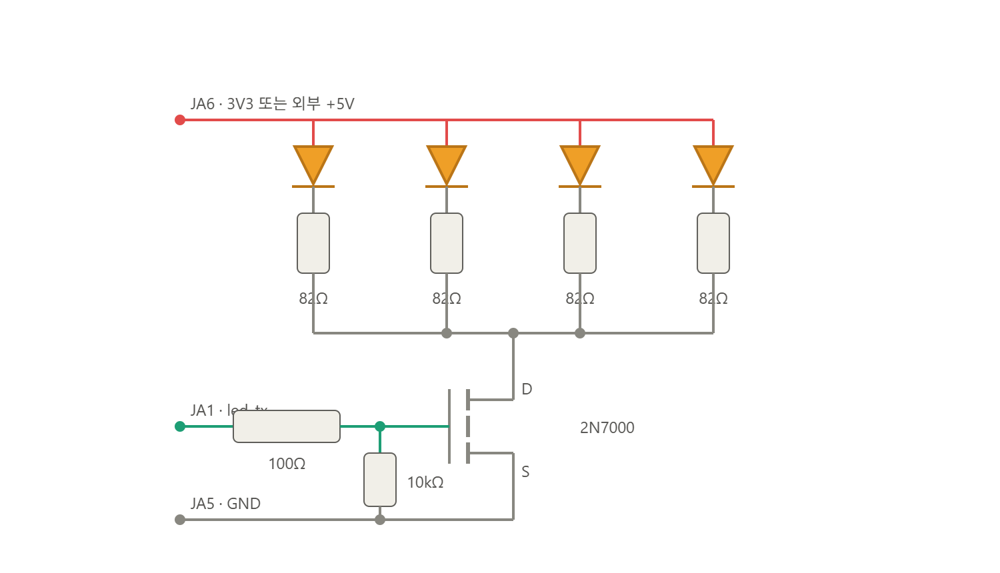
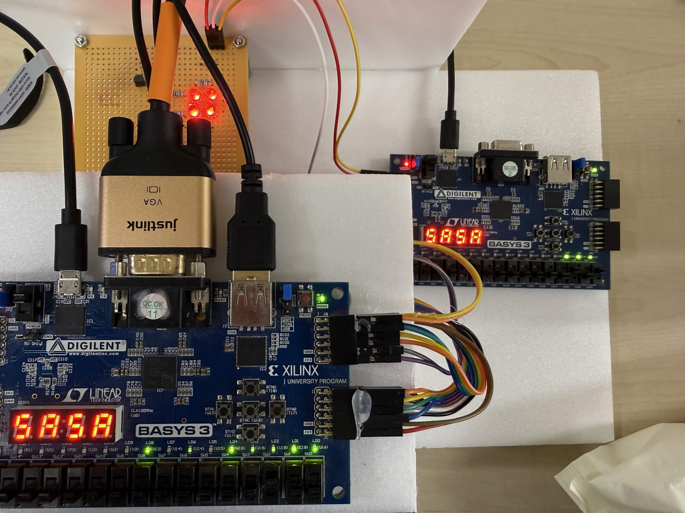
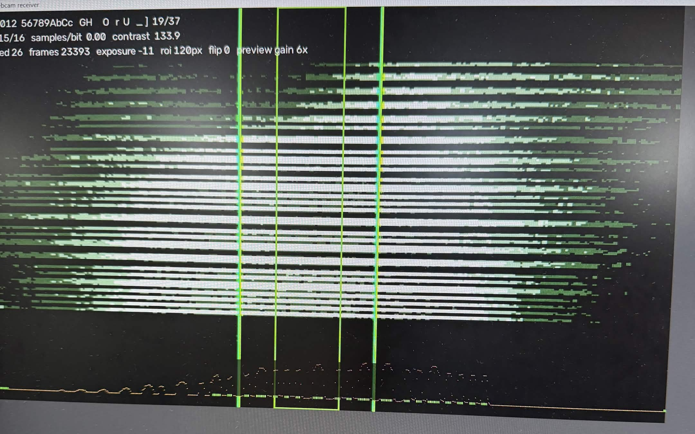
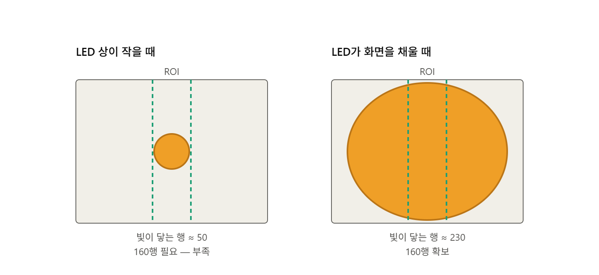

# Rolling-Shutter OCC v3

Basys3 태그 보드의 LED 점멸을 OV7670 카메라의 rolling-shutter 행 밝기로 수신하는 광통신 RTL입니다. 리더는 행 밝기를 비트열로 복조하고 패킷의 자격증명과 CRC를 검사한 뒤 FND, VGA, LED 및 UART로 상태를 출력합니다.


## 데이터 경로

```text
Tag Basys3
  occ_tx_core -> LED OOK/Manchester
                         |
                         v
Reader Basys3 + OV7670
  row capture -> row brightness -> occ_rx_core -> credential/CRC result
       |                                      |-> FND/LED/UART
       +-> frame buffer -> VGA                +-> PC listener
```

태그는 패킷을 연속 송신합니다. 리더는 OV7670의 240개 유효 행에서 LED 상의 밝기 변화를 추출하고 동기워드, 자격증명과 CRC를 복구합니다.

## 하드웨어 구성

### LED 송신 회로



`led_tx`는 100Ω을 거쳐 2N7000의 gate를 구동하고, 10kΩ pull-down이 reset 또는 미구동 상태에서 MOSFET을 끕니다. 네 개의 LED는 각각 82Ω 전류 제한 저항을 사용하며 2N7000이 공통 low-side switch로 전류를 제어합니다. 전원은 Basys3의 3.3V 또는 외부 5V를 사용할 수 있고, 외부 전원을 사용할 때는 보드와 GND를 공유합니다.

### 실제 구현



데모는 분리된 Tag TX와 Reader RX Basys3 보드, 4-LED 송신부 및 카메라·VGA 연결로 구성됩니다. 리더가 측정한 카메라 행 주기를 TX 반비트 clock 값으로 환산해 FND에 표시하고, 태그는 해당 값에 맞춰 LED를 변조합니다.

## 패킷 형식과 변조

```text
SYNC(16) = 0xAAD3 | PASSWORD(16) | CRC8(PASSWORD) = 40 bits
```

- 한 비트는 카메라 4개 행에 대응합니다.
- 한 패킷은 160개 행을 사용하며 240개 행 안에 80개 행의 탐색 여유가 남습니다.
- `occ_pkg.sv`가 동기워드, CRC 함수와 16비트 자격증명 값을 송수신 양쪽에 공통 제공됩니다.
- `SW14=0`은 OOK, `SW14=1`은 Manchester 변조입니다.

현재 16비트 자격증명은 패킷에 평문으로 전송되는 데모용 식별 값입니다.

## RTL 및 도구 구성

```text
Rolling_Shutter_OCC/
├── common/rtl/
│   ├── occ_pkg.sv             패킷, CRC, 자격증명, 7-segment 함수
│   └── fnd_controller.sv      FND multiplexing
├── tx_board/
│   ├── rtl/occ_tx_core.sv     연속 OCC 송신기
│   ├── rtl/top_tag_tx.sv      태그 보드 top
│   └── constraints/Basys3_TAG_TX.xdc
├── rx_board/
│   ├── rtl/occ_rx_core.sv     행 밝기 기반 패킷 복조기
│   ├── rtl/ov7670_*.sv        카메라 설정 및 행 수집
│   ├── rtl/sccb_master.sv     OV7670 SCCB 제어
│   ├── rtl/frame_buffer.sv    VGA용 프레임 버퍼
│   ├── rtl/vga_display.sv     밴딩 영상 출력
│   ├── rtl/uart_tx.sv         판정 결과 송신
│   ├── rtl/top_reader_rx.sv   리더 보드 top
│   └── constraints/Basys3_READER_RX.xdc
├── tools/
│   └── occ_webcam_rx.py       PC 카메라 수신 및 복호화 시각화
└── assets/
    ├── rolling_shutter_occ_demo.gif
    ├── occ_led_driver.png
    ├── occ_hardware_demo.jpg
    ├── occ_receiver_monitor.jpg
    └── occ_led_roi_coverage.png
```

## 보드 설정

### Tag TX

| 입력 | 기능 |
|---|---|
| `SW3:SW0` | 송신할 16비트 자격증명 선택 |
| `SW11:SW4` | 반비트 주기: `switch × 128 + 128` system clocks |
| `SW14` | `0`: OOK, `1`: Manchester |
| `SW15` | 송신 enable |
| `BTNU` | 누르는 동안 현재 반비트 값을 FND에 표시 |
| `BTNC` | reset |

### Reader RX

| 입력 | 기능 |
|---|---|
| `SW3:SW0` | 허용할 자격증명 선택 |
| `SW5:SW4` | 카메라 노출: 1/2/4/8 rows |
| `SW7:SW6` | 카메라 gain: `00/40/80/FF` |
| `SW9:SW8` | FND: 자격증명/contrast/peak/tag target |
| `SW14` | `0`: OOK, `1`: Manchester |
| `SW15` | `1`: 카메라 anti-flicker banding filter 비활성화 |
| `BTNU` | 카메라 재초기화 및 노출·gain 적용 |
| `BTNC` | reset |

노출과 gain은 SCCB 재설정 값이므로 스위치를 변경한 뒤 `BTNU`를 눌러야 적용됩니다.

## 검증 결과

### 실제 수신 화면



수신 화면에서 밝고 어두운 수평 밴드가 LED의 시간축 변조를 카메라 행 방향으로 나타냅니다. 녹색 가이드는 밝기 profile을 추출하는 ROI를 표시하며, 해당 구간의 행 밝기 변화로 패킷을 복호화합니다.

### 근거리 배치 이유



현재 패킷은 40비트이고 비트당 4개 행을 사용하므로 한 프레임에서 연속 160개 행이 LED 상에 포함되어야 합니다. 거리가 멀어 LED 상이 작아지면 약 50개 행만 밝아져 패킷 전체를 담을 수 없습니다. 데모에서는 송신부를 가까이 배치해 네 LED의 상이 약 230개 행을 덮도록 하여 160개 유효 행과 충분한 밝기 대비를 확보했습니다.

여기서 약 230개 행은 프레임 안에서 LED 상이 차지하는 공간적 높이입니다. 카메라 노출 설정의 1/2/4/8 rows는 각 행의 밝기를 적분하는 시간 길이이므로 두 값은 서로 다른 항목입니다.

### 하드웨어 동작 확인

리더 UART는 115200 baud, 8-N-1 형식으로 판정 결과를 출력합니다.

```text
OPEN 1234
DENY A1B2
```

리더 LED는 단계별 수신 상태를 표시합니다.

| LED | 확인 신호 |
|---|---|
| `LD0` | 카메라 초기화 완료 |
| `LD1` | 프레임 수신 |
| `LD2` | 동기워드 검출 |
| `LD3` | CRC 통과 |
| `LD4` | 태그 검출 |
| `LD5` | 자격증명 일치 |
| `LD6` | UART 송신 중 |
| `LD7` | SCCB ninth-bit 상태 |
| `LD8` | 복조 오류 |

## 트러블슈팅

### 실측 행 주기 기반 TX 타이밍 설정

분리된 태그 보드는 리더 카메라의 HREF를 직접 사용할 수 없으므로 자체 100 MHz system clock으로 반비트 시간을 생성해야 합니다. 초기에는 OV7670 QVGA 행 주기를 65.4 µs로 계산해 반비트 기준값을 13,080 clocks로 두고 작은 trim 범위만 제공했습니다.

실제 측정에서는 `SCALING_PCLK_DIV`가 PCLK뿐 아니라 frame rate도 낮추면서 행 주기가 125.4 µs로 나타났고, 필요한 반비트 값은 25,087 clocks였습니다. 예상값과 실측값의 차이가 기존 trim 범위 ±1,024 clocks보다 커서 광학 대비가 충분해도 TX와 RX의 비트 타이밍이 맞지 않았습니다.

해결 방법은 예상값을 RTL 상수로 두지 않고 리더가 실제 행 주기를 측정해 필요한 TX 값을 FND(7-segment)에 출력하는 구조입니다.

```text
OV7670 row tick
  -> 8 rows skip
  -> measure exactly 64 row periods
  -> half_bit_target = measured clocks / 32
  -> Reader FND hex display
  -> Tag switch setting
  -> TX half-bit clock
```

측정 로직은 처음에 64개 행을 측정한다고 작성했지만 실제로는 63개 행 간격만 누적하는 off-by-one 오류가 있어 약 1.6% 오차가 발생했습니다. `meas_active` 구간의 시작과 끝을 수정해 정확히 `MEAS_ROWS=64`개 행 주기를 포함하도록 했습니다. 현재 계산식은 두 행이 반비트 하나이므로 `half_bit_target = (meas_count + 1) / (MEAS_ROWS / 2)`입니다.

리더의 `SW9:SW8=11`에서 측정된 `half_bit_target`이 16진수로 표시됩니다. 태그는 작은 trim이 아니라 `SW11:SW4` 값을 다음 식으로 직접 인코딩해 128~32,768 clocks 전체 범위를 설정합니다.

```systemverilog
half_bit_clks = {sw_trim, 7'b0} + 16'd128;
```

예를 들어 리더 FND가 `61FF`, 즉 25,087 clocks를 표시하면 태그 `SW11:SW4`를 195로 설정합니다. 태그에서 `BTNU`를 누르면 FND에 설정값 25,088 clocks가 표시되며, 두 값의 1-clock 차이는 약 0.004%입니다.

contrast가 확보되는데도 `LD2` sync가 검출되지 않으면 광량보다 먼저 리더 FND의 실측 `half_bit_target`과 태그 FND의 `half_bit_clks`가 일치하는지 확인합니다.

1. 리더 `SW9:SW8=11`에서 실측 target을 확인합니다.
2. 태그에서 `BTNU`를 누른 상태로 `SW11:SW4`를 조절해 표시값을 target에 가장 가깝게 맞춥니다.
3. `BTNU`를 놓고 송신한 뒤 `LD2` sync, `LD3` CRC 순서로 확인합니다.
4. target이 비정상적으로 작거나 프레임마다 크게 변하면 `LD1` 프레임 수신과 64행 측정 구간을 확인합니다.

### Manchester 복조 실패

Manchester 모드에서 타이밍 값이 맞아도 복조되지 않으면 노출을 1행으로 설정합니다. 반비트가 2행인데 노출도 2행 이상이면 중간 전이가 평균화되어 `sample_a ^ sample_b` 유효성 검사를 통과하지 못할 수 있습니다. 노출과 gain을 바꾼 뒤에는 `BTNU`로 OV7670 설정을 다시 적용합니다.

## 설계 보고서

- [Rolling-Shutter OCC v3 기술보고서](../DOC/OCC/OCC_롤링셔터_v3_기술보고서.pdf)
